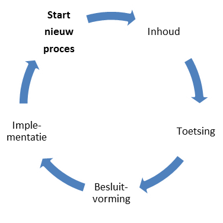

## Gebruik van het wijzigingsprotocol

**Het protocol schrijft een vast stramien voor van fasen en op te leveren resultaten. Belangrijk zijn de randvoorwaarden, uitgangspunten. De gebruikers van de geo-standaard betrekken wij bij het wijzigen van de geo-standaard. We zetten op en rij welke betrokkenen er zijn. Voor de volledigheid wordt hier nogmaals benadrukt dat onderstaande tekst van toepassing is op de standaarden die Geonovum volledig in beheer heeft. Daar waar de formele governance plaatsvind bij NEN of OGC, geldt dat Geonovum zoveel mogelijk in de geest van dit protocol handelt.**

### Protocol versus proces

De titel van dit document geeft aan dat het hier om een protocol gaat. Toch wordt in dit document ook gesproken over processen. Een wijzigingsprotocol beschrijft de manier waarop wijzigingen in de basisset geo-standaarden plaatsvinden: het wijzigingsproces. In het protocol zijn basisbegrippen en uitgangspunten uiteengezet voor het wijzigingsproces, bijvoorbeeld wat onder nieuwe en volgende versies verstaan wordt en wanneer deze verwacht mogen worden. De daadwerkelijke planning van een nieuwe versie is op hoofdlijnen uitgewerkt in de standaardenagenda die Geonovum jaarlijks opstelt. Deze standaardenagenda zal nog worden vertaald naar een roadmap, waarin voor de komende jaren de verdere ontwikkeling en de uitfasering van de (verschillende versies van de) standaarden wordt getoond.

Met behulp van een wijzigingsprotocol voor de basisset geo-standaarden geeft Geonovum:
- inzicht in het behandel- en besluitproces dat ten grondslag ligt aan het versiebeheer;
- inzicht in de aangeboden wijzigingsvoorstellen;
- stabiliteit aan de standaard;
- continuïteit aan de standaard;
- een eenduidige aanpak.

De stabiliteit en continuïteit van de standaard maken wij inzichtelijk met de [standaardenagenda](https://geonovum.github.io/Geo-standaarden-beheerplan/#standaardenagenda) en op termijn de roadmap.

### Releasebeleid  

#### Nieuwe geo-standaard of wijziging van een geo-standaard

Bij een geo-standaard in beheer horen ook afspraken over het versiebeheer. Versies van een standaard zijn er in verschillende gradaties die elk een relatie hebben met een voorgaande versie. De wijzigingen documenteren wij en leggen wij vast in een apart document bij de uitgebrachte versie van de standaard. De gebruiker kan zo nagaan op welke plaatsen de betreffende standaard gewijzigd is.

Geonovum hanteert drie typen versies voor een wijziging van een basis geo-standaard. Bijvoorbeeld: versie 2.1.0 (=X.Y.Z):
- **X-wijzigingen** Deze wijzigingen veranderen de structuur van de standaard. Hierdoor zijn X-wijzigingen niet backwards compatible. Frequentie: maximaal 1 keer per 3 jaar.
- **Y-wijzigingen** Dit zijn wijzigingen die niet de structuur veranderen. Dit kunnen bijvoorbeeld updates zijn of inhoudelijke aanpassingen aan objecten, attributen of waardelijsten of de reikwijdte van de standaard. Deze wijzigingen zijn backwards compatible. Frequentie: maximaal 1 keer per jaar.
- **Z-wijzigingen** Dit zijn in feite oplossingen van technische fouten of verbeteringen van technische aard. Deze wijzigingen zijn backwards compatible. Frequentie: zo spoedig mogelijk na constatering.

#### Oude versie van een standaard

Na het uitbrengen van een nieuwe versie van een bij Geonovum in beheer zijnde geo-standaard blijven oudere versies beschikbaar en zijn vindbaar via de Geonovum website en de registers (de [conceptenbibliotheek](https://definities.geostandaarden.nl/home) , het [technisch register](https://register.geostandaarden.nl/)  en het [documentenregister](https://docs.geostandaarden.nl/) ). Een nieuwe versie dwingt daarmee geen directe overstap af bij de gebruikers, tenzij anders (bijvoorbeeld wettelijk) bepaald. Na het uitbrengen van de nieuwe versie van een geo-standaard wordt de ontwikkeling van de oude versie stopgezet.

Voor het onderhoud en de ondersteuning van een oude versie van een geo-standaard gelden de volgende uitgangspunten:
1.	Aan een oude versie worden geen nieuwe features toegevoegd na het uitbrengen van een nieuwe versie. Verzoeken om aanpassing en wijziging voor nieuwe functionaliteit worden niet meer voor de oude geo-standaard in behandeling genomen. Z-wijzigingen zijn nog wel mogelijk, indien het gebruik in de praktijk dit nog rechtvaardigt.
2. 	De programmaraad stelt met advies van de beheerder vast hoelang een oude versie wordt ondersteund en wanneer hij komt te vervallen (decline). Dit betekent dat vragen over het gebruik van de geo-standaard worden beantwoord (helpdesk). Daarnaast ondersteunen we de oude versie van de geo-standaard in de validator. De maximale ondersteuningstermijn is twee jaar, tenzij de programmaraad anders bepaalt. Daarna blijft de versie van de geo-standaard wel beschikbaar, maar biedt Geonovum geen ondersteuning meer, ook niet via de validator. Bij standaarden die niet meer worden ondersteund, wordt duidelijk vermeld of zichtbaar gemaakt dat deze zijn vervallen.

In het algemeen zal de Programmaraad alleen besluiten om een versie te laten vervallen en de ondersteuning te staken, als het de verwachting en/of de intentie is dat gebruikers alleen nog actief de nieuwe versie toepassen en daarbij ondersteuning behoeven.

### Proces varianten

In paragraaf [Oude versie van een standaard](#Oude-versie-van-een-standaard) zijn de X, Y en Z wijzigingen uitgelegd. Voor wijzigingen kent Geonovum twee proces varianten. Eén voor X en Y wijzigingen en één voor Z wijzigingen. 

**Proces voor X en Y wijzigingen**

Deze vergen volledige afstemming en het doorlopen van alle in paragraaf 3.4 beschreven fasen: Inhoud, Toetsing, Besluitvorming en Implementatie. Voor de inhoudelijke fase wordt een werkgroep gestart met daarin vertegenwoordiging van belangrijke stakeholders. Het resultaat van de werkgroep wordt in een openbare consultatie getoetst. Besluitvorming over vaststelling van een standaard vindt plaats in de programmaraad van Geonovum. Indien nodig wordt met softwareleveranciers een convenant afgesloten of een bestaand convenant uitgebreid, waarin wordt afgesproken dat zij (onderdelen van) de standaard gaan ondersteunen.

**Proces voor Z wijzigingen**

Deze dienen zo snel als mogelijk uitgevoerd te worden. De inhoudelijke fase wordt door een medewerker van Geonovum gedaan. Toetsing vindt plaats d.m.v. een (beperkte) consultatie met stakeholders. Besluitvorming vindt plaats door het standaardenteam van Geonovum met een notificatie van de wijziging aan de programmaraad. Implementatie vindt plaats door het publiceren van de wijziging op de website van Geonovum. 

### Fasen en resultaten

Het volledige wijzigingsproces doorloopt de fasen Inhoud, Toetsing, Besluitvorming en Implementatie, zoals weergegeven in onderstaand figuur. 

**figuur Fasen wijzigingsproces**

**Inhoud**

In de fase inhoud wordt voor iedere melding bepaald of deze wordt opgenomen in de nieuwe versie van de standaard of niet. Dit wordt vastgelegd in Mantis, Github of een andere issue tracker en is zichtbaar op de website van Geonovum. Voor meldingen die worden meegenomen in de nieuwe versie van de standaard, worden oplossingen uitgewerkt, op basis waarvan vervolgens de specificatie wordt aangepast. Dit gebeurt door Geonovum in samenwerking met inhoudelijke experts. Afhankelijk van de omvang van de wijziging ten opzichte van de voorgaande versie is de groep van experts evenredig groter of kleiner. 

**Toetsing**

De fase Toetsing vormt een brug tussen de inhoud, besluitvorming en de implementatie. In deze fase wordt eenieder (X, Y wijziging) of een beperkte groep belanghebbenden (Z wijziging) uitgenodigd om zijn visie te geven op de nieuwe versie van de standaard. De reacties uit de consultatie worden verwerkt in de specificatie. 

**Besluitvorming**

Bij Besluitvorming wordt besloten om de gewijzigde specificatie vast te stellen en te publiceren. Afhankelijk van het type wijziging en de betreffende geo-standaard (X, Y of Z, zie paragraaf [Proces varianten](#Proces-varianten) , besluit de Programmaraad dan wel het standaardenteam van Geonovum. Eenmaal vastgesteld en gepubliceerd, wordt de nieuwe versie van de standaard aangemeld bij het Forum Standaardisatie.

**Implementatie**

Het in gebruik nemen van de geo-standaard in de praktijk staat centraal in deze fase. Hiervoor leveren we verschillende technische bestanden op, zoals implementatiebestanden, voorbeeldbestanden en voorbeeldberichten. Deze bestanden ondersteunen softwareleveranciers bij de implementatie van de standaard in hun software. Beheerders van de voorziening/ het register e.d. nemen de geo-standaard over. Daarnaast stelt Geonovum validators beschikbaar, waarmee de technische juistheid van de implementatie van standaarden kan worden getoetst. Wij ondersteunen de implementatie bovendien door de werking van de geo-standaard toe te lichten op bijvoorbeeld een wiki. Resultaat van deze fase is dat de gebruikers data kunnen maken en uitwisselen conform de nieuwe standaard. In hoofdstuk [Implementatie](#Implementatie) lichten we de implementatie verder toe.

### Betrokkenen

De volgende groepen en instanties zijn betrokken bij het wijzigingsproces van de geo-standaard:
-	Werkgroep
-	Softwareleveranciers
-	Programmaraad
-	Forum Standaardisatie
-	VNG Realisatie in verband met software catalogus

**Werkgroep en softwareleveranciers**

Nieuwe versies van de geo-standaard bereidt Geonovum voor in samenwerking met de werkgroep(en) met daarin gebruikers en/of softwareleveranciers. We streven naar een unanieme instemming met de standaard. Dit versterkt het draagvlak en zorgt voor een betere implementatie van de geo-standaard in het werkveld. 

**Programmaraad**

Bij het vaststellen van een nieuwe versie (X, Y) van een standaard stelt de programmaraad met advies van Geonovum vast hoelang een oude versie wordt ondersteund en wanneer een oude versie komt te vervallen. Het vaststellen van Z-wijzigingen (zie paragraaf [Oude versie van een standaard](#Oude-versie-van-een-standaard)) wordt door Geonovum zelf uitgevoerd zonder tussenkomst van de programmaraad. Een uitzondering hierop is het Basismodel Geo-informatie (NEN 3610). De programmaraad stelt de nieuwe versie van NEN 3610 niet vast, maar keurt hem goed (of af) en draagt deze vervolgens voor aan de NEN normcommissie 351 240 Geo-informatie. Deze commissie verzorgt de openbare consultatie en stelt de geo-standaard formeel vast. 

**Forum Standaardisatie**

De basisset geo-standaarden staat op de Pas toe of leg uit-lijst van het Forum Standaardisatie. Organisatorisch bestaat er geen formele relatie tussen de programmaraad en het Forum Standaardisatie. De programmaraad stelt (versies van) geostandaarden vast (voor zover dat niet in de governancestructuur van NEN of OGC gebeurt); het Forum Standaardisatie besluit uiteindelijk of die vastgestelde (versies van) geo-standaarden ook de status krijgen die behoort bij opname op de Pas toe of leg uit-lijst (de verplichting voor overheden om die standaarden uit te vragen bij aanbestedingen). 

Geonovum heeft het predicaat uitstekend beheer voor de huidige standaarden (NEN3610, GML, serviceprofielen en metadataprofielen) in de set geo-standaarden. Dit betekent dat Geonovum het beheer en versiebeheer van die geo-standaarden zodanig open en structureel heeft vormgegeven, dat het Forum erop vertrouwt dat alle mogelijke belangen die spelen rondom de standaarden correct zijn meegenomen en afgewogen door Geonovum bij de totstandkoming van de nieuwe versie van de standaard. Op het moment dat Geonovum (of een andere partij) een nieuwe versie van een basis geo-standaard aanmeldt, wordt deze door het Forum in de regel na een veel lichtere procedure opgenomen.

Geonovum kondigt consultaties over de basis geo-standaarden aan bij Bureau Forum Standaardisatie, zodat zij hierover kan berichten op haar website of twitterkanaal.

**VNG Realisatie**

Verschillende standaarden die Geonovum beheert, komen voor in de GEMMA standaardenlijst en de GEMMA softwarecatalogus van VNG Realisatie. In de GEMMA standaardenlijst wordt bijgehouden welke versies van de standaarden 'in ontwikkeling', 'in gebruik', 'teruggetrokken' of 'niet ondersteund' zijn. Geonovum bepaalt wat de status van de standaardversies is.
